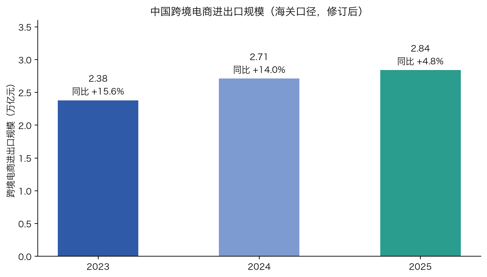
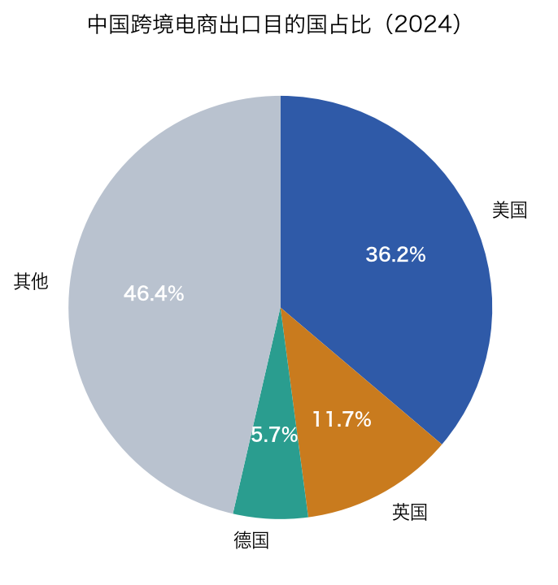
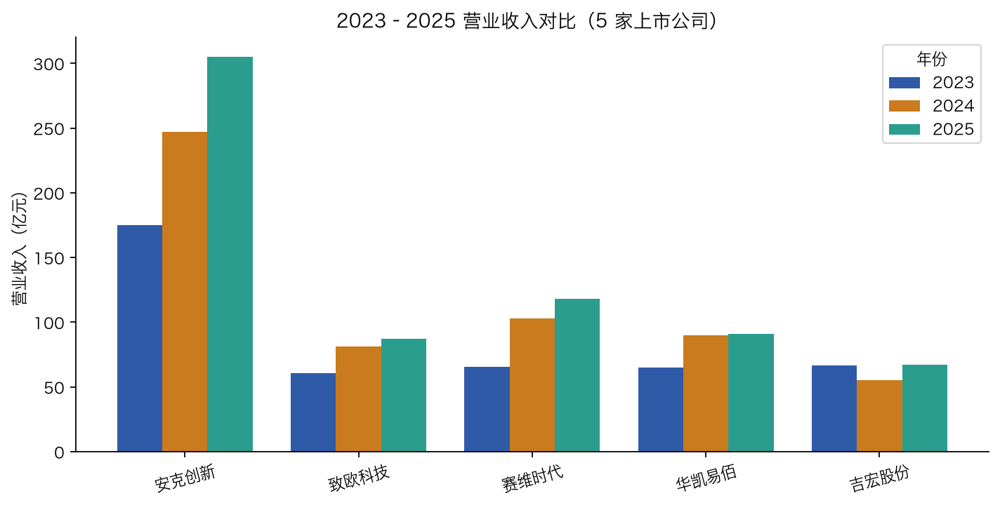
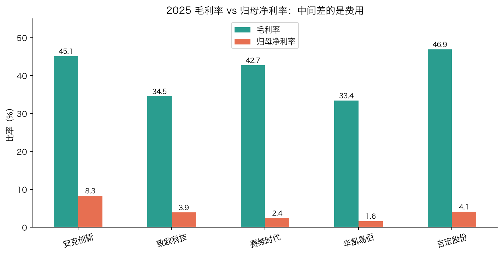
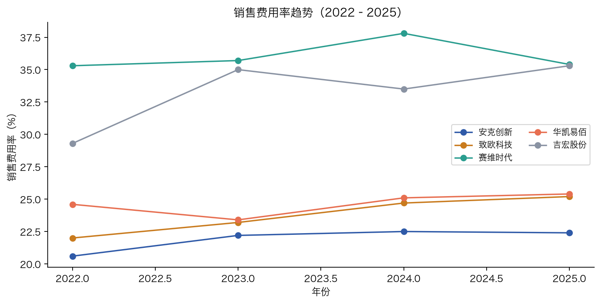
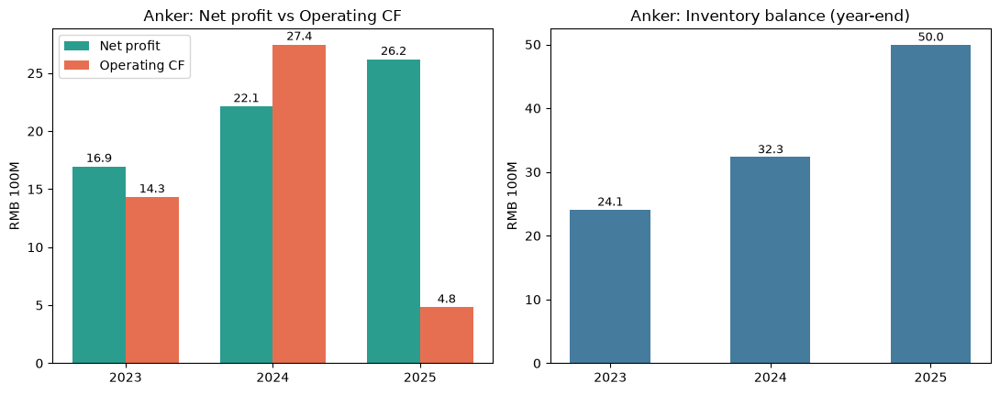

# 实现过程：从原始数据到图表与结论

作者：Xuefei Wang · 2026
说明：本文记录我实现这个项目的完整过程——数据从哪来、存在哪、每个指标怎么算、图怎么画、每一步在验证什么问题。全部可复现，脚本在 `scripts/`，图表在 `reports/figures/`。

## 1. M1 数据底座：先把"能比较的宽表"建起来

分析 5 家 A 股公司，代码：安克创新 300866、致欧科技 301376、赛维时代 301381、华凯易佰 300592、吉宏股份 002803。

**取数**：用 akshare 的公开接口拉两类数据——
- 财务摘要（`stock_financial_abstract`，新浪财经源）：营收、归母净利、净利润、经营现金流等 80 项指标 × 多个报告期；
- 主营构成（`stock_zygc_em`，东方财富源）：分产品/分行业/分地区的收入、收入占比、毛利率。

**落盘**（`data/`）：
- `data/raw/`：每家公司的原始表（abstract_代码.csv、zygc_符号.csv）；
- `data/consolidated/`：合并后的分析表——`financial_abstract_long.csv`（公司×报告期×指标长表，方便过滤透视）、`annual_key_metrics.csv`（只取 12/31 年报口径的关键指标，跨公司年度对比用）、`zygc_all.csv`（5 家主营构成合并）。

**为什么先做这一步**：接口数据是宽表、口径不统一（季报是累计值、主营地区只到境外/境内），不整理成"同口径长表 + 数据字典"，后面任何对比都会算错。`reports/00_数据字典.md` 记录每张表和每列的口径。

**抽查核验**：安克创新 2025 全年营业总收入接口值 ≈ 305.1 亿元，与公开年报一致，才继续往下做。

## 2. M2 宏观：行业到底多大、往哪走

宏观数字全部来自官方/可核验来源，手工整理成一张源表（`data/consolidated/m2_macro_source.csv`），每个数字都带来源与口径：

- 2025 年跨境电商进出口**终核** 2.84 万亿元，其中出口 2.27 万亿元，同比 +4.8%（海关总署 2026-06 发布）；增速从过去 +10~15% 换挡；
- 出口目的地：美国 36.2%、英国 11.7%、德国 5.7%（2024）——美国仍是第一大市场；
- 主体：官方口径"跨境电商主体超 12 万家"；企查查口径 2023 年新注册 5,818 家（+44%）、2024 年 8,598 家（+47%）；网经社"死亡名单"可见案例 2022 年 31 家、2023 年 11 家、2024 年 50 家。

画成两张图（中文）：





读法：行业还在涨但增速换挡；美国是基本盘；主体进出都很快 → 为后面"模式/存活"问题铺底。

## 3. M3 公司对比：为什么"毛利率高 ≠ 赚钱"

**指标口径**（详见 `02` 同目录口径文档/数据字典）：
- 毛利率 =（营业收入 − 营业成本）/ 营业收入；
- 销售费用率 = 销售费用 / 营业收入；
- 净利率 = 归母净利润 / 营业收入；
- 营收同比增速 =（本期营收 − 上年同期营收）/ 上年同期营收；
- 存货周转率 = 营业成本 / 平均存货。

用 `annual_key_metrics.csv` 算 5 家 2025 年报口径结果（单位 %）：

| 公司 | 模式 | 毛利率 | 销售费用率 | 净利率 | 营收增速 |
|---|---|---|---|---|---|
| 安克创新 | 精品品牌 | 45.1 | 22.4 | 8.3 | +23.5 |
| 致欧科技 | 精品品牌 | 34.5 | 25.2 | 3.9 | +7.1 |
| 赛维时代 | 泛品铺货 | 42.7 | 35.4 | 2.4 | +15.0 |
| 华凯易佰 | 泛品铺货 | 33.4 | 25.4 | 1.6 | +1.2 |
| 吉宏股份 | 品牌+社交电商 | 46.9 | 35.3 | 4.1 | +21.6 |

图表（中文）：







**这步验证的问题**：赛维毛利率 42.7% 高于致欧的 34.5%，净利率却只有 2.4% vs 3.9%——差别全在销售费用率（35.4% vs 25.2%）。这直接回应我的猜测②（竞争加剧导致广告获客成本上升）：铺货靠买量换规模，销售费用把毛利吃掉；精品靠品牌词与复购，同样卖货推广花得更少。

## 4. M3b 现金流深挖：为什么"利润 ≠ 现金"

安克 2025 归母净利 25.5 亿元，经营现金流只有 4.8 亿元（OCF/净利 ≈ 0.19）。我打开现金流量表的**调节附表**（把净利润一步步调回经营现金流），定位钱去哪了：

- 主要去向是**存货增加**（同比 +18~20 亿元）与**应收**占款；
- 折旧摊销等非现金项会加回，但盖不住存货对现金的占用。

图（中文）：



**这步验证的问题**：账面盈利和手里有钱是两回事。对重备货的跨境卖家，利润被库存占住 = 现金流风险，这就是我为什么在结论里强调 OCF/净利 比净利率更能预警。

## 5. 每步在验证我最初的困惑

| 阶段 | 验证的问题 |
|---|---|
| M2 宏观 | 行业还有多大、还在涨吗、进出有多快（问题①） |
| M3 公司对比 | 精品 vs 铺货谁的利润留得住、费用结构差异（问题②） |
| M3 地区/渠道 | 欧洲 vs 美加、亚马逊 vs 独立站对毛利费用的影响（问题③） |
| M3b 现金流 | 为什么单品盈利没变成整体现金（问题④） |

## 6. 一键复现

```bash
# 环境：Python 3.10+
pip install akshare pandas matplotlib
# M1 数据底座
python scripts/fetch_financials.py
# M3 公司对比 + M3b 现金流深挖
python scripts/m3_company_analysis.py
python scripts/m3b_anker_cashflow.py
# 中文图表（一键重画 6 张，Hiragino 字体）
python scripts/make_all_charts_zh.py
```

数据源逐条口径见 `reports/00_数据字典.md`，宏观口径与来源见 `reports/04_宏观与行业.md`。
